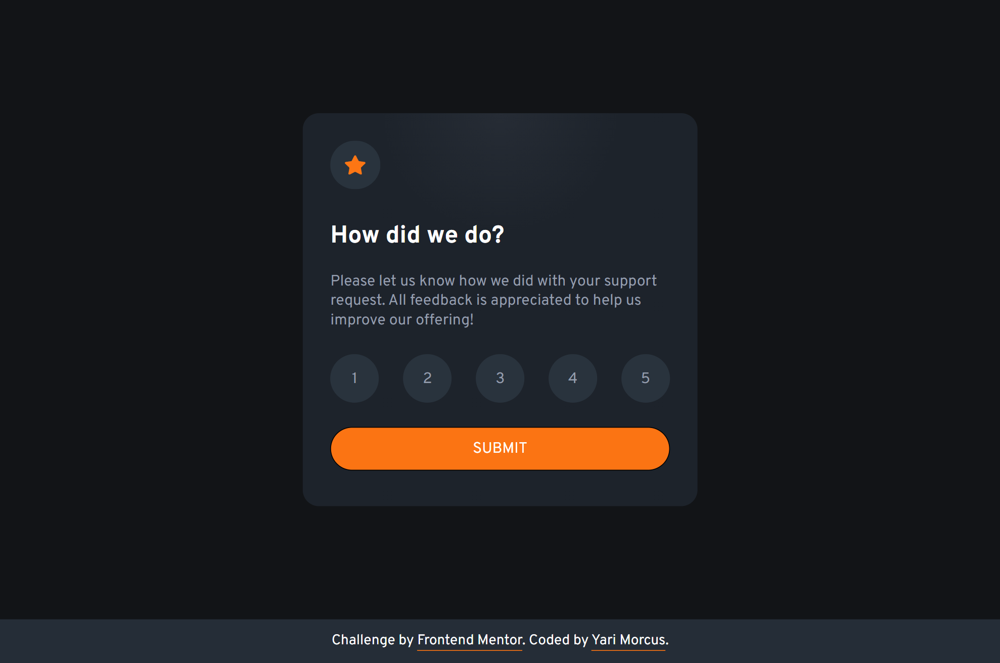
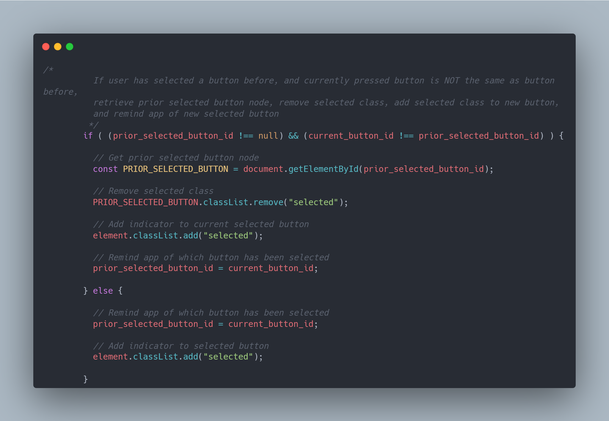

# Frontend Mentor - Interactive rating component solution

This is a solution to the [Interactive rating component challenge on Frontend Mentor](https://www.frontendmentor.io/challenges/interactive-rating-component-koxpeBUmI). Frontend Mentor challenges help you improve your coding skills by building realistic projects. 

## Table of contents

- [Overview](#overview)
  - [The challenge](#the-challenge)
  - [Links](#links)git 
- [My process](#my-process)
  - [Built with](#built-with)
  - [What I learned](#what-i-learned)
    - [Things I should keep in mind](#things-i-should-keep-in-mind)
  - [Continued development](#continued-development)
  - [Useful resources](#useful-resources)
- [Author](#author)

## Overview

### The challenge

Users should be able to:

- View the optimal layout for the app depending on their device's screen size
- See hover states for all interactive elements on the page
- Select and submit a number rating
- See the "Thank you" card state after submitting a rating

### Links

- Solution URL: [Open GitHub repository](https://github.com/YariMorcus/interactive-rating-component)
- Live Site URL: [open GitHub Pages page of repository](https://yarimorcus.github.io/interactive-rating-component)

## My process

### Built with

- Semantic HTML5 markup
- CSS
- Flexbox
- JavaScript (+ ES)
- Mobile-first workflow
- [Node.js](https://nextjs.org/) - Open source and multiplatform JavaScript runtime environment
- [NPM](https://www.npmjs.com/) - Package Manager for Node JavaScript platform
- [Browsersync](https://browsersync.io) - Synchronous browser testing (in collaboration with gulp)
- [Gulp](https://gulpjs.com) - Build tool used as workflow automation tool
- [Sass](https://sass-lang.com/) - CSS Preprocessor (in collaboration with gulp)
- [GitHub](https://github.com/YariMorcus/interactive-rating-component) - Technological platform based on Git
- [Git](https://git-scm.com/) - Free and open source distributed version control system

### What I learned

There are a couple of things I learned, which are listed below:
1. That you should always start with using semantic compliants-standard HTML first
  This is important for Web Accessibility _(also refered to as a11y)_, because people who are using assistive technologies such as screenreaders should also be able to use the application.

2. That I should always validate my HTML and CSS markup with a validation service.
3. That CSS should be applied when the HTML foundation has been laid out, and is still accessible for assistive technologies.
  _Otherwise it will become harder to make it accessible later on_
4. That JavaScript should be applied when both HTML and CSS are working.
5. How to use addEventListeners within JavaScript, retrieve nodes, remind previous values, boolean conditionals, add and remove classes and how to loop over an array
6. How NPM, Gulp, and Browsersync works _(in the most basic way)_. 
7. How to use Markdown to format this README.md file

#### Things I should keep in mind

There are however two things I should pay attention to the next time:
1. Starting to use branches within Git.
  During the development I forgot to use branches for the features I was developing.
  This is something I should have done but forgot to do (due to my inexperience :blush:).

2. Remind myself more of _(or don't forget)_ the requirements of the application
  I was so busy writing JavaScript, that I forgot that the user has to press the submit button first, before showing the thank you card. What I did was showing the thank you card immediately when the user clicked on one of the rating buttons, which shouldn't have been the case.
  As a result, I had to modify JavaScript so the requirements were met.

Here is a screenshot of some JavaScript I wrote for the app:

### Continued development

The way I want to continue to develop myself is by focusing on laying out a proper foundation of HTML, CSS, and JavaScript.
This is so I can build quality websites for clients, by just using the core languages of the Web.
At the present, I am working on the above things by going through (interactive) articles on the MDN Web Docs (see chapter [Useful resources](#useful-resources)).

Another way I want to improve my knowledge of these subjects is to do more challenges that [Frontend Mentor](https://www.frontendmentor.io/challenges) is offering, starting at the lowest level and building that up to the more advanced ones.

Besides the above, I want to continue to develop myself by using several tools more often to improve my workflow, and spend less time doing things that can be automated.
A few tools that I will start using more often are:
1. Gulp
2. Git
3. GitHub

_I will learn the above-mentioned points in-between but do not want to focus myself too much on those at the moment._

As soon as I am capable of creating quality websites from just the core languages of the Web, I will start to take a look (learn, not look :blush:) at JavaScript libraries and frameworks. Both of these change over time, so I do not want to spend my time on those before I have a solid understanding of prior mentioned languages.

### Useful resources

- [Gulp v4 - Sass and Browsersync setup](https://youtu.be/QgMQeLymAdU) - YouTube video from Kevin Powell. This video helped me to setup Gulp, Sass and Browsersync at the moment that I did not have any knowledge of these subjects yet.
- [MDN Web Docs](https://developer.mozilla.org/en-US/) - The MDN Web Docs is something that I have been using as a reference for both HTML and JavaScript. This at moments that I needed more information about a specific subject.
- [Frontend Mentor - Interactive rating component challenge](https://www.frontendmentor.io/challenges/interactive-rating-component-koxpeBUmI) - (this one cannot be forgotten of course)

## Author

- LinkedIn - [Yari Morcus](https://www.linkedin.com/in/yarimorcus/)
- Frontend Mentor - [@YariMorcus](https://www.frontendmentor.io/profile/YariMorcus)
